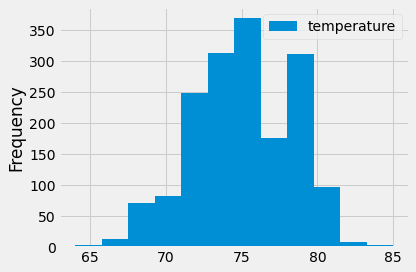
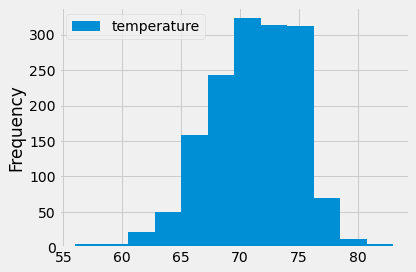
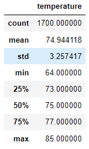
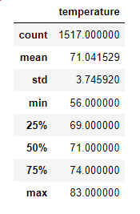

# Module 9 Surfs Up Challenge
## Overview of the analysis
Using SQLite, Python, Pandas functions and methods, and SQLAlchemy, W. AVY, the owner of a potential surf and ice cream shop, has asked for an analysis of temperature data for the months of December and June in Oahu, Hawaii to determine if such a business is sustainable year round.
## Results
### Strategy
Two complete this task, two deliverables were produced. The first deliverable was an analysis for the month of June and the second deliverable was an analysis for the month of December. Each analysis included a link to the Hawaii sqlite database and a query that filtered the measurement table to retrieve temperatures for the specified month. The results were converted to a list and then to a Pandas dataframe where the results could easily be summarized statistically. Please refer to the full code by clicking the following link . 
### Analysis
There are three major points from the two analyisis deliverables
  
  1) The average temperature in June is ~ 75 deg F and the most frequent temperature in June is 75 deg F followed by temperatures slightly cooler and temperatures in the upper 70s. Below is a frequency histogram of temperatures for the month of June .
  2) The average temperature in December is ~71 deg F and the most frequent temperature in June is 70 to 75; their frequencies are pretty consistent. Below is a frequency histogram of temperatures for the month of December .
  3) The standard deviation in temperature in June and December is 3.26 and 3.75, respectively.

Below are the Summary Statistics for June 

.

Below are the Summary Statistics for December

.
  
## Summary

The weather based on temperature in Oahu in June and in December does not vary by a very large margin and would definitely sustain surfing and ice cream sales. W. Avy ahould open his shop based on weather. W. Avy should also include Hwaiian Shave Ice with his shop because they are delicious and I believe the weather promotes the sustainability of their sales year round as well.

Two additional queries that should be performed to gather more weather data for June and December are:
  1) A comparison of precipitation to see if there is a stormy season that would prevent people from wanting to surf or enjoy ice cream
  2) A comparison of sunrise and sunset data to determine if there is a significant difference in the length of daylight or perhaps data on cloud cover to determine any significant difference in sunny days in general. People like to surf and eat ice cream when it is sunny.
